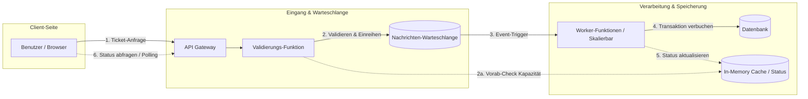

# Architekturskizze

```mermaid
graph LR
    subgraph "Client-Seite"
        U[Benutzer / Browser]
    end

    subgraph "Eingang & Warteschlange"
        AGW[API Gateway]
        LF1[Validierungs-Funktion]
        Queue[(Nachrichten-Warteschlange)]
    end

    subgraph "Verarbeitung & Speicherung"
        LF2[Worker-Funktionen / Skalierbar]
        DB[(Datenbank)]
        Cache[(In-Memory Cache / Status)]
    end

    %% Datenfluss
    U -->|1. Ticket-Anfrage| AGW
    AGW --> LF1
    LF1 -->|2. Validieren & Einreihen| Queue
    LF1 -.->|2a. Vorab-Check Kapazität| Cache
    Queue -->|3. Event-Trigger| LF2
    LF2 -->|4. Transaktion verbuchen| DB
    LF2 -.->|5. Status aktualisieren| Cache
    U -.->|6. Status abfragen / Polling| AGW
```

## Komponentenübersicht

- Client
- API Gateway
- Validierungs-Funktion
- Nachrichten-Warteschlange
- Worker-Funktionen
- Datenbank
- In-Memory Cache
