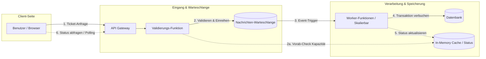

# Architekturskizze

## Komponentenübersicht

- Client
- API Gateway
- Validierungs-Funktion
- Nachrichten-Warteschlange
- Worker-Funktionen
- Datenbank
- In-Memory Cache

### Client

Es braucht einen Client, mit dem die Tickets gekauft werden können. Dies wird wahrscheinlich eine simple Webapplikation werden.

### API Gateway

Der API Gateway nimmt Requests zum kaufen von Tickets entgegen. Wenn ein Ticket im Kaufprozess ist, frägt man laufend den Status des Kaufs ab.

### Validierungs-Funktion

Die Funktion prüft zuerst im Memory-Cache ob man noch genügend Kapazität für das Event hat. Falls ja wird ein Event in die Queue geschrieben. Falls nein

### Nachrichten-Warteschlange

In der Warteschlange sind in geordneter Reihenfolge die angefragten Bestellungen vorhanden.

### Worker-Funktionen

Die Worker-Funktionen, arbeiten laufend die Nachrichten aus der Warteschlange ab.

- Speichert den Ticketkauf in die Datenbank
- Schreibt den Status in den Memory-Cache

Es soll möglich sein mehrere Worker-Funktionen gleichzeitig laufen zu lassen. (Skalierbar)

### Datenbank

Der Ort, an dem die Transaktionen final und dauerhaft gespeichert werden (z. B. "Ticket verkauft an User X").

### In-Memory Cache

Im Memory-Cache wird der aktuelle Status von Events und Ticket-Käufen festgehalten.
